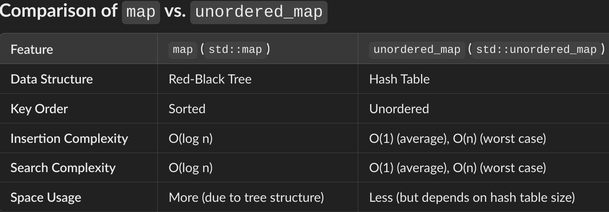

```cpp
class Solution {
public:
    vector<int> twoSum(vector<int>& nums, int target) {
        unordered_map<int, int> numMap;
        int n = nums.size();

        for (int i = 0; i < n; i++) {
            int complement = target - nums[i];
            if (numMap.count(complement)) {
                return {numMap[complement], i};
            }
            numMap[nums[i]] = i;
        }

        return {}; // No solution found
    }
};
```

unordered_map.count():
returns -> 0 if element is absent
returns 1 -> element is present

